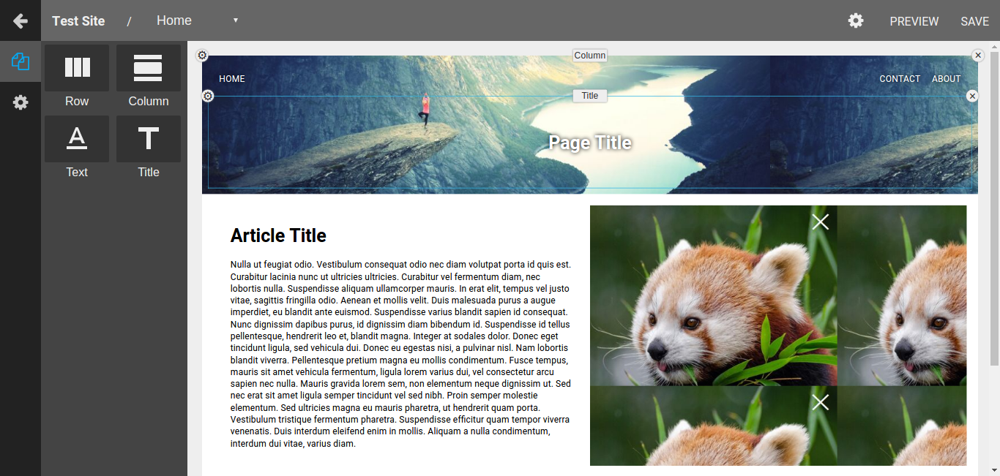

# DRAGONDROP Node.js backend

[Live](https://dragon-drop-node.herokuapp.com)

This project implements a node.js backend for my previous, [DRAGONDROP](https://www.github.com/gregchamberlain/dragon-drop) full-stack web app. For this implementation I utilized the Express Framework to handle http requests, mongodb as a database, and mongoose as the mongo ORM. There were also several additions made to the front end, including a brand new drag and drop page layout editor.

## Models

To handle and store the data on the backend I used mongoose to create models for `user`s, `site`s, and `page`s. Each of these models use validators to ensure consistent data. These validators are very similar to the ones used on my prior project and include required fields, unique fields, etc. Here is an example of the `Site` model I used.

```js
const SiteSchema = new Schema({
  userId: { type: Schema.ObjectId, ref: 'User', require: true, index: true},
  name: { type: String, required: [true, 'Name can\'t be blank.'] },
  identifier: {
    type: String,
    required: [true, 'Identifier can\'t be blank.'],
    unique: true
  },
  rootPage: { type: Schema.ObjectId, ref: 'Page', required: true },
  template: { type: Boolean, default: false}
}, {
  timestamps: true
});
```

## Routes

To handle routing and http requests in general I used the `Express` Framework. I used the express router to namespace my endpoints under /api, and also for each enpoint after that to keep my code modular. I also used the express `body-parser`, and `cookie-parser`. The `body-parser` parses query strings, and request bodies into a consistent, predictable object. The `cookie-parser` was used to handle session cookies. Here is an example of the endpoint used to sign a user in.

```js
router.post('/', (req, res, next) => {
  User.findOne({email: req.body.user.email}, (err, user) => {
    if (err) return next(err);
    if (!user) return res.status(404).json({message: 'A user with that email does not exist.'});
    if (bcrypt.compareSync(req.body.user.password, user.passwordDigest)) {
      res.cookie(
        '__DRAGONDROP__SESSION',
        user.sessionToken,
        { maxAge: 365 * 24 * 60 * 60 * 1000, httpOnly: true }
      );
      user.populateSites((err1, u) => {
        if (err1) return next(err);
        res.json(u);
      });
    } else {
      res.status(400).json({message: 'Invalid password for that email'});
    }
  });
});
```

## Frontend

A few changes where made to the frontend in this project as well. First off, a few tweaks needed to be made to make the old frontend work with the new backend. I switched from using `jQuery` to  `whatwg-fetch` for ajax requests. The layout editor used to create and customize pages was also updated. In my prior project I used the react-grid-layout library to handle the layout, but for this project I wrote my own layout editor that is more flexible, and powerful. The code for this layout editor (react-dnd-layout) can be found [here](https://www.github.com/gregchamberlain/react-dnd-layout).

## react-dnd-layout
My layout package is standalone, and handles the layout, and editing of props for the items on each page. The package includes both a layout for editing a page by dragging and dropping items, and a layout for rendering a static version of that layout. A few simple components to add to layouts are also included as additional exports (`Row`, `Column`, `Text`, `Title`, `Image`). It is simple to use and takes props for the normalized data for items in the layout, the id of the root item, components to populate the catalog, and an onChange function for the editor component. The catalog can be populated with any custom components if desired. It will dynamically generate a `Form` to edit each components `prop`s from the `defaultProps` of that component. Optionally you may use my other package [react-formulate](https://gregchamberlain.github.io/react-formulate) to specify a `propInputs` attribute on your custom components, which will be then be used as the `prop` editing `Form`. An example of this layout component is shown below.

```js
import DragDropLayout, { Row, Column, Text, Title, Image} from 'react-dnd-layout';

const comps = {
  Row,
  Column,
  Text,
  Title,
  Image
}

...

<DragDropLayout
  items={items}
  rootId="root"
  components={comps}
  onChange={this.handleChange} />

...

```
Here is a screenshot of the new layout editor.




## Missing Features
There are a few features that have not been implemented yet from my previous project. These include:
- [ ] Site Deployment
- [ ] View Tracking

## Future Features
- [ ] Implement missing features from previous project.
- [ ] Add more custom components
- [ ] Optimize SEO for client sites by server rendering pages.
